# Energy Tracker for Sigenergy

A home energy dashboard that runs as a Home Assistant app (add-on). It reads solar, battery
and grid sensors from Home Assistant, stores them, and shows live power flows, daily use and
what your electricity has cost on your own tariff.

> **Compatibility: Sigenergy systems only.** This was built for a Sigenergy solar and
> battery system and reads the sensors created by the Sigenergy integration for Home
> Assistant. It will show nothing on other inverters unless you edit the sensor list
> yourself. Amounts show in pounds and pence unless you set another currency.

A heat pump (or other device) on the Sigenergy gateway's smart load port and a Tesla Wall
Connector are picked up automatically if present. Their tiles are left out if not.

If you find it useful, you can [buy me a coffee](https://buymeacoffee.com/badpanda).

## Screenshots

The figures shown are made-up example data.

**Live readings, today's use and running costs**

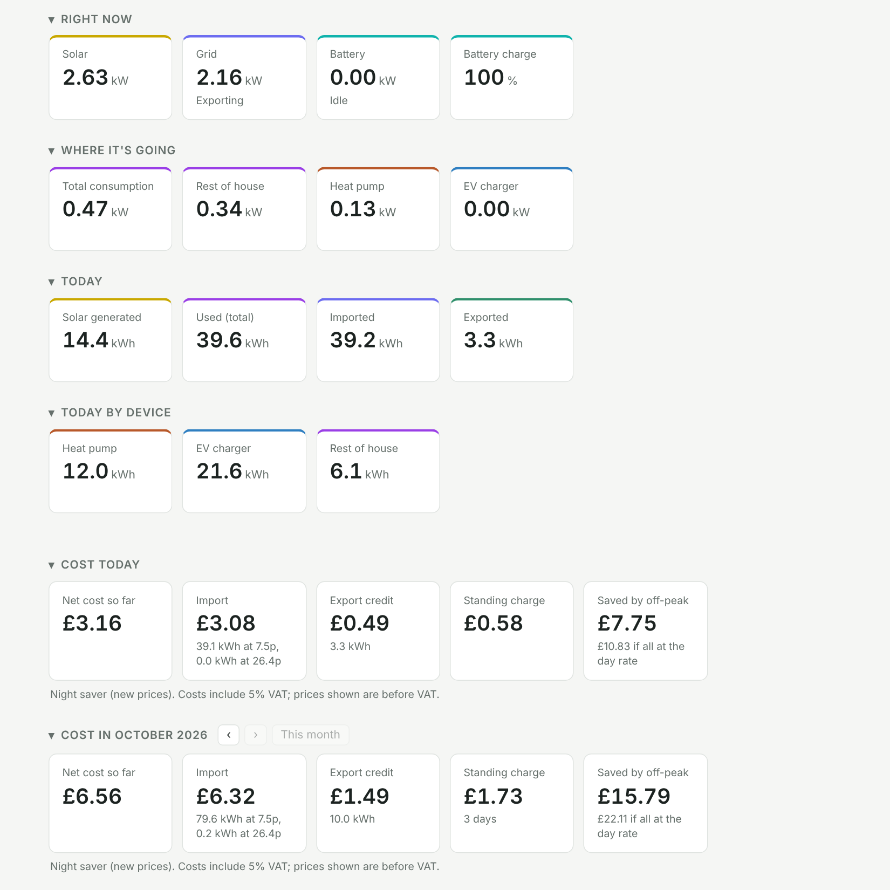

**Power metrics and consumption breakdown, here over the last 7 days**

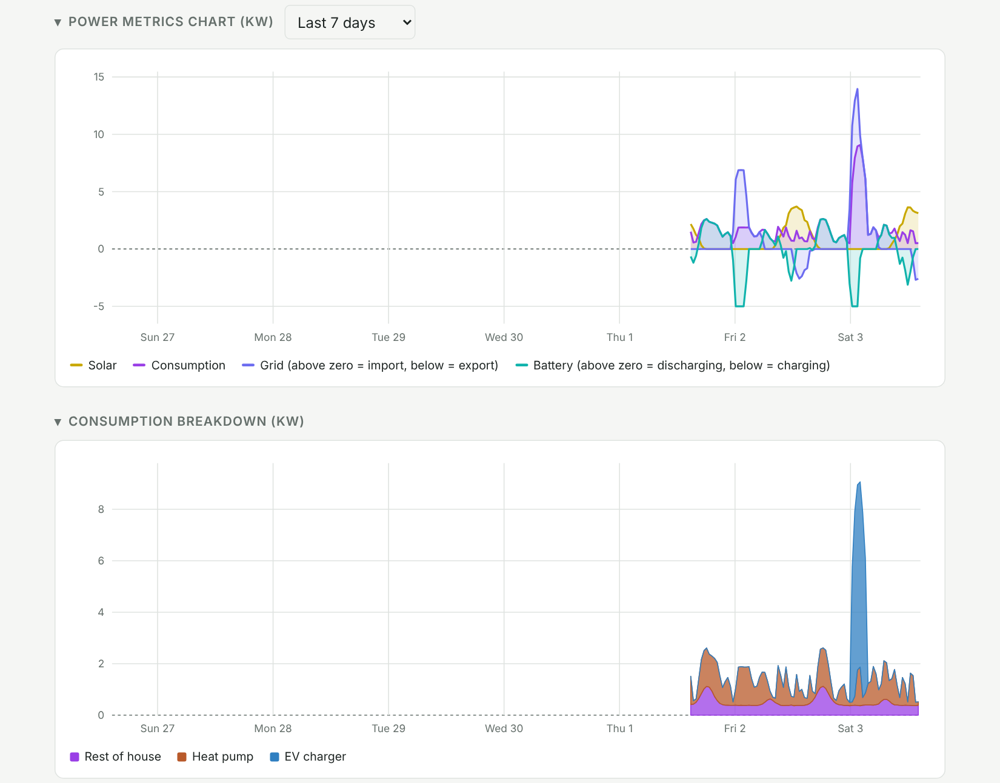

**Costs by year and month, and editable tariff rates**

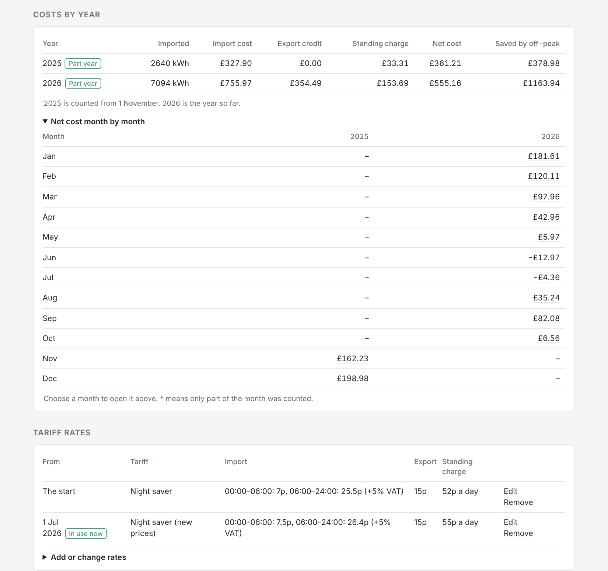

**Running costs by device**

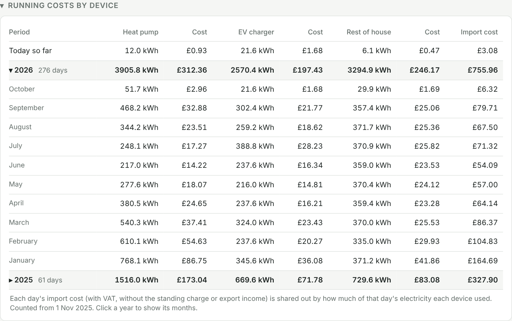

**History for any day, week, month or year**

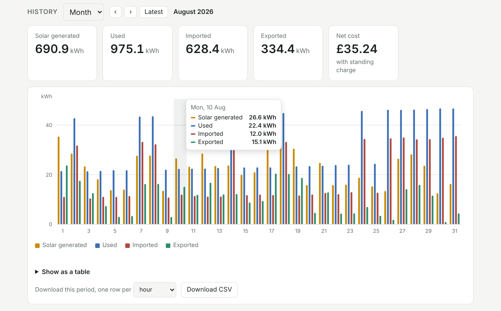

**Performance, and whether a bigger battery would pay**

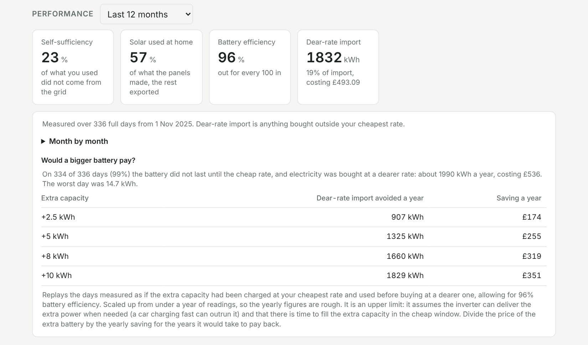

**Monthly summary**

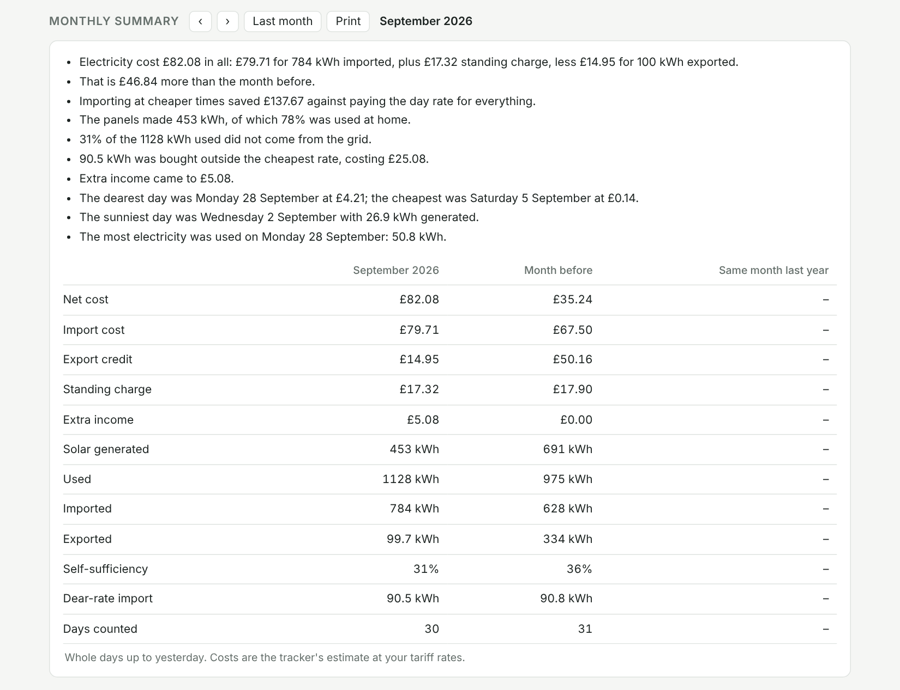

**Bill check**

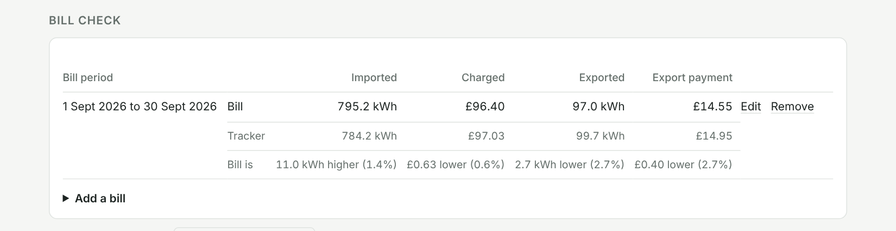

**Return on investment: savings building towards the system's cost, and the profit beyond it**

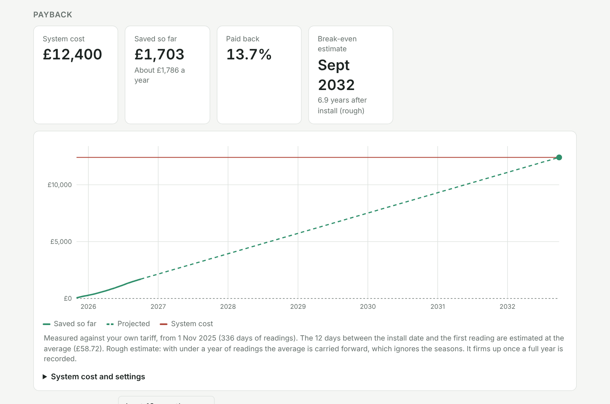

**Extra income, such as Axle Energy export events**

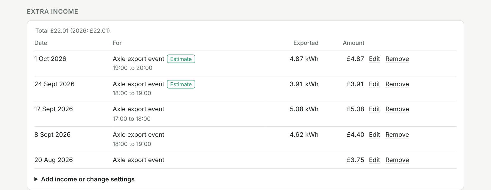

**Comparing tariffs on your real usage**

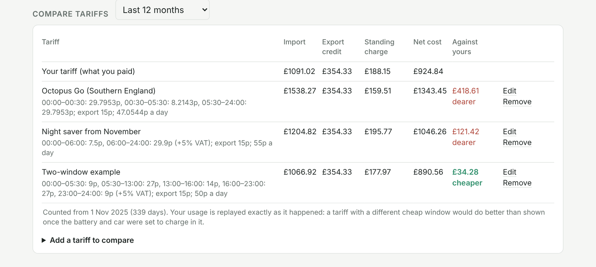

**Tariff switch planner: a year on another tariff, with a charging plan**

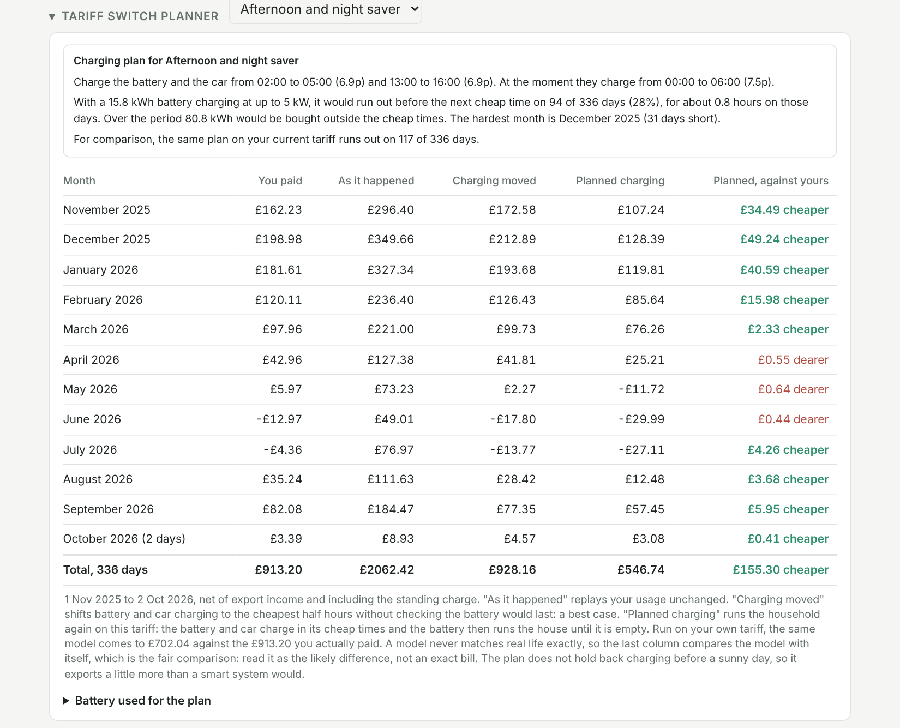

## What it shows

- **Right now**: solar, house load, grid, battery power and battery charge level, following
  Home Assistant live.
- **Where it's going**: smart load (such as a heat pump), EV charger and the rest of the house, where those are fitted.
- **Running costs by device**: what the smart load, the EV charger and the rest of the house
  cost to run, by month and year.
- **Today**: energy generated, used, imported and exported, and use by device.
- **Cost today and by month**: import cost, export credit, standing charge and VAT, with
  buttons to step back through earlier months.
- **Costs by year**: every month and year side by side.
- **Saved by off-peak**: what the same import would have cost at the day rate, minus what
  it did cost.
- **Charts**: power flows and consumption breakdown for the last 24 hours, today, the last
  7 days or the last 30 days. Click a legend entry on any chart to show or hide that
  series. Breaks in the data are shown as breaks, not joined up.
- **History**: any past day, week, month or year as a chart and table, with a CSV download.
- **Performance**: self-sufficiency, battery efficiency and dear-rate import, with estimates
  of what a bigger battery, more panels or a bigger inverter would save.
- **Monthly summary**: a month on one page, against the month before and a year earlier.
- **Yearly report**: a year on one page, beside the year before, ready to print, with a
  costs-hidden version for sharing.
- **Notes**: pin a note to a day; it shows as a marker on the charts.
- **Backup and restore**: everything you have entered saved as one file, to keep or to move
  to another install.
- **Bill check**: your bill's figures beside what the tracker measured for the same dates.
  It can read them from an E.ON Next or Octopus Energy bill PDF, without the file leaving
  your device. Bills are grouped by year, with totals for each year and overall. If a bill's
  rates differ from yours, it offers to correct them.
- **Extra income**: payments on top of your tariff, typed in or recorded automatically from
  Axle Energy export events.
- **Return on investment**: what the system has saved against its cost, with a progress bar,
  an estimated break-even date and a chart running on to the profit in later years.
- **Compare tariffs**: replay your real usage on other tariffs, typed in or looked up from
  Octopus Energy's published prices, or test a price change on your own tariff. A second
  figure shows each tariff with battery and car charging moved to its cheapest times.
- **Tariff switch planner**: the last twelve months on another tariff, month by month, with
  a charging plan showing whether the battery would last between its cheap times.
- **Tariff rates**: editable on the page. Each set of rates has a start date, so a price
  change only affects days from that date onward. A day can have several time windows with
  their own prices, or follow Octopus Agile's half-hourly prices. A fixed-price deal can
  have its end date, with a reminder a month before.
- **Older history**: imports hourly history from Home Assistant, plus an export from the
  mySigen app for the time before Home Assistant has any. See
  [how to get an hourly export from Sigen AI](energy_tracker/DOCS.md#getting-an-hourly-export-from-sigen-ai).

## How it works

| Part | What it does |
|---|---|
| Collector | Reads every sensor in `config/metrics.toml` from Home Assistant every 30 seconds (adjustable). |
| Backfill | After any break (restart, update, backup), fetches the missed readings from Home Assistant's history, up to 10 days back. |
| Database | One SQLite file in the add-on's data folder. Readings older than 30 days are thinned to one per 5 minutes to keep it small. |
| Costs | Lifetime energy counters are split into half-hour slots and priced with the tariff that applied on each day. |
| Dashboard | A single web page served by the same process. No build step and no external scripts. |

It is written in Python 3.12 with FastAPI and runs as a single small container.

## Install on Home Assistant

Needs Home Assistant OS or Supervised (anything with add-ons, called "Apps" in recent
versions), and the Sigenergy integration already set up.

1. In Home Assistant go to **Settings > Apps** (or **Add-ons**) and open the store.
2. Open the **⋮** menu, choose **Repositories**, and add:
   `https://github.com/Suchabadpanda/ha-energy-tracker`
3. Find **Energy Tracker** in the store and install it. The first build takes 5 to 10
   minutes.
4. Turn on **Start on boot**, **Watchdog** and **Show in sidebar**, then **Start**.
5. Open **Energy Tracker** from the sidebar, enter your rates under **Tariff rates**, and
   optionally run **Import older history**.

Options, optional equipment and using different sensors are covered in
[the app's documentation](energy_tracker/DOCS.md).

## Security

- The dashboard opens through Home Assistant (ingress), so it is behind Home Assistant's
  login. The app publishes no network port and refuses connections from anywhere else.
- It uses the access Home Assistant gives the app. There is no token or password to store.
- It only reads from Home Assistant. It never changes a device or setting.
- For access away from home, use whatever you use for Home Assistant itself (Tailscale or
  Home Assistant Cloud). Do not forward a router port to it.

## Backups

The database lives in the app's data folder, so Home Assistant backups include it. The app
pauses for a few seconds while a backup is taken and fills the gap afterwards.

## Development

Run it outside Home Assistant with Docker:

```bash
cd energy_tracker
bash scripts/init-env.sh        # asks for the Home Assistant address and an access token
docker compose up -d --build    # dashboard on http://<this-machine>/
docker compose logs -f
```

Run the tests and checks (needs [uv](https://docs.astral.sh/uv/)):

```bash
uv sync
uv run pytest -q
uv run ruff check src tests
uv run ruff format src tests
```

### Layout

```
repository.yaml            Tells Home Assistant this repository holds an app
energy_tracker/
  config.yaml              App definition and options
  DOCS.md                  Documentation shown inside Home Assistant
  Dockerfile               Container image
  compose.yml              Stand-alone development setup
  config/metrics.toml      Which Home Assistant sensors to collect
  config/tariff.toml       Example rates, used once on first run
  src/energy_tracker/      The app (collector, storage, costs, web page)
  tests/                   Unit tests
```

### API

| Address | Returns |
|---|---|
| `GET /api/latest` | Most recent stored value of every metric |
| `GET /api/live` | Newest value of each power sensor, straight from Home Assistant |
| `GET /api/devices` | Running cost by device, by month and year |
| `GET /api/series?metric=…&hours=24` | Averaged history for charts |
| `GET /api/today` | Today's energy by device and cost so far |
| `GET /api/month?month=YYYY-MM` | Cost of a calendar month |
| `GET /api/years` | Costs for every month and year |
| `GET/POST /api/tariffs`, `DELETE /api/tariffs/{date}` | Read and change rates |
| `POST /api/import-history` | Import older history (body: optional Sigenergy `.xlsx`) |

## Limitations

- Costs are estimates from the inverter's counters, not your supplier's meter. Expect small
  differences from your bill.
- Half-hourly prices can only be followed for Octopus Energy's Agile tariffs, the one
  price list an app can read without an account.
- The history import reads Sigenergy exports only.
- Runs on 64-bit ARM and x86 machines (aarch64, amd64).

## Support and licence

This is a personal project shared as it is, with no guarantee of support. Released under
the [MIT licence](LICENSE).

## Buy me a coffee

Energy Tracker is free and always will be. If it has been useful to you and you would like
to say thanks, you can [buy me a coffee](https://buymeacoffee.com/badpanda). Donations are
entirely optional and do not buy support or features.
